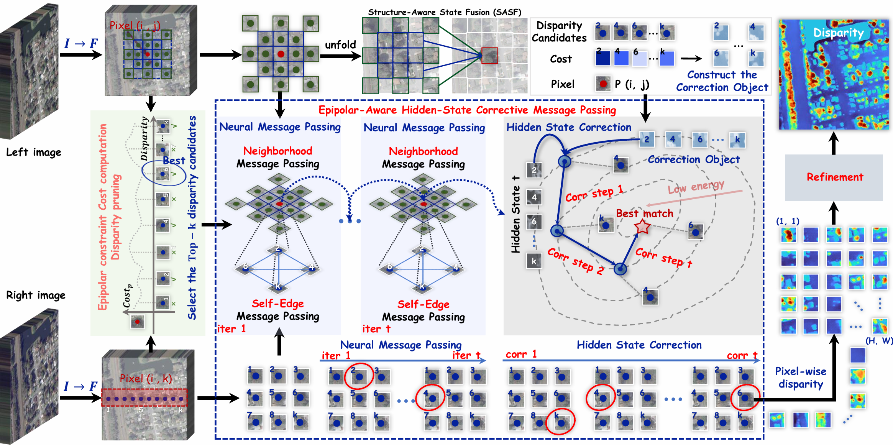
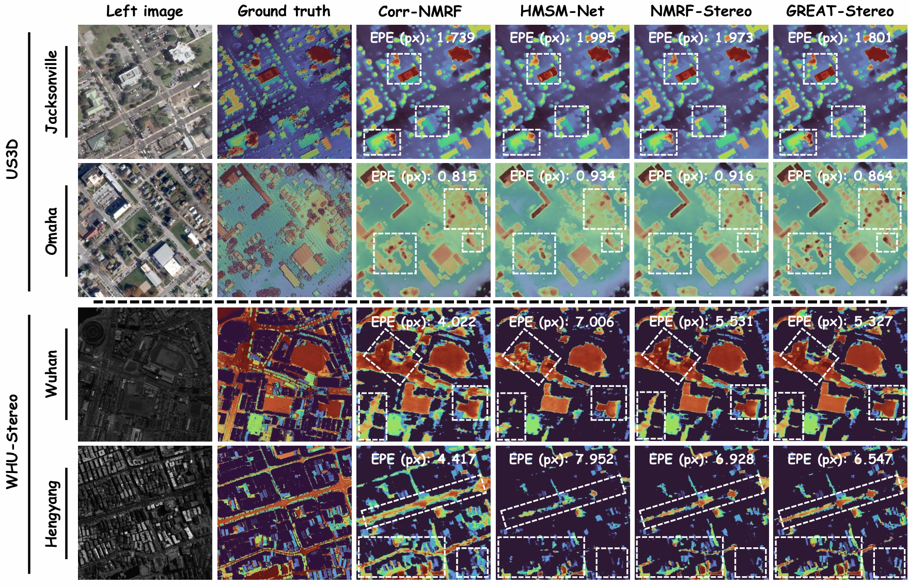
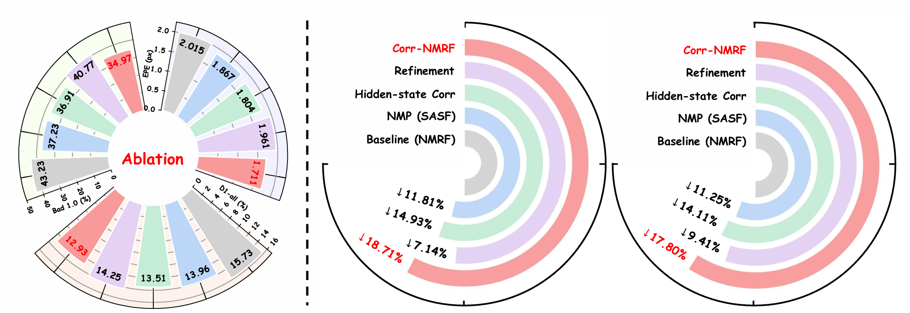
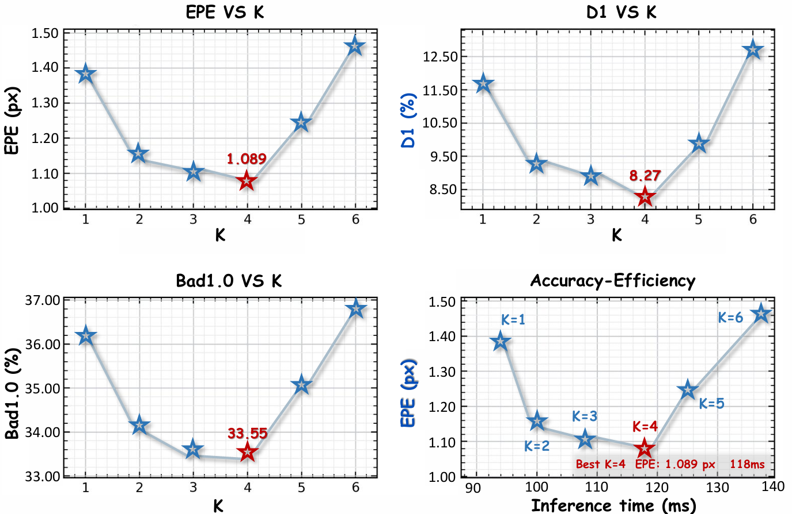

# Corr-NMRF

Official PyTorch implementation of **Epipolar-Aware Hidden-State Corrective Neural MRF for Remote Sensing Stereo Matching**.

Corr-NMRF is designed for remote sensing stereo matching, where repetitive textures, weakly textured rooftops, vegetation occlusions, and sharp height discontinuities often make multiple disparity hypotheses locally plausible. Instead of only propagating proposal states, Corr-NMRF explicitly verifies and corrects hidden states with left-right epipolar feature residuals and correlation evidence during Neural MRF inference.

<p align="center">
  
</p>

## What Is New

Corr-NMRF extends Neural MRF stereo matching with **epipolar-aware hidden-state corrective message passing**. The core idea is simple: a wrong disparity candidate should not be propagated unchanged just because it is connected in the inference graph. For every selected candidate, Corr-NMRF constructs an observation-dependent correction target from the disparity-warped right feature, the left feature, and the sampled correlation evidence. The hidden state is then corrected before structure-aware neighborhood propagation.

<p align="center">
  
</p>

## Method Overview

Given a rectified stereo pair, Corr-NMRF follows a compact coarse-to-fine pipeline:

1. Extract left and right stereo features with a lightweight ResNet backbone.
2. Build an epipolar-constrained group-wise correlation volume.
3. Use DPN to prune the full disparity range into top-K candidates.
4. Update candidate hidden states with self-edge and neighborhood-edge message passing.
5. Correct unreliable hidden states using epipolar residuals and correlation evidence.
6. Refine the coarse disparity map to recover local details.

Compared with the original aggregation-driven Neural MRF inference, Corr-NMRF adds evidence-driven correction inside the message passing process. In the released WHU configuration, this is implemented by `CorrNMRFNMP` in `corr_nmrf/models/corr_nmrf_nmp.py`.

## Key Components

- **Disparity pruning.** DPN selects compact candidate disparities from the epipolar cost volume, reducing the label space before Neural MRF inference.
- **Self-edge message passing.** Candidate-wise multi-head attention lets the top-K hypotheses of the same pixel compete and exchange information.
- **Epipolar-aware correction.** Left-right feature residuals and correlation embeddings form a proposal-specific correction target.
- **Learnable candidate gate.** `TTT_CORR_LAMBDA` initializes a learnable gate instead of acting as a fixed correlation weight.
- **SASF neighborhood propagation.** Multi-dilation depth-wise convolution propagates corrected states while preserving 2-D spatial structure.

## Results And Ablations

The paper evaluates Corr-NMRF on multiple remote sensing stereo benchmarks, including US3D, GaoFen-7, WHU, and WHU-Stereo. The visual comparisons show more complete disparity maps, sharper building boundaries, and fewer local artifacts in ambiguous regions.

<p align="center">
  
</p>

<p align="center">
  
</p>

## Repository Structure

```text
assets/                       # Method, comparison, and ablation figures
configs/
  whu_stereo_resnet.yaml      # WHU Corr-NMRF training/evaluation config
corr_nmrf/
  config/                     # YACS configuration
  data/                       # WHU stereo dataset loader and augmentations
  models/                     # ResNet backbone, DPN, NMP, Corr-NMRF model
  utils/                      # logging, evaluation, image IO, visualization
main.py                       # training and evaluation entry
inference.py                  # WHU/custom-pair inference entry
environment.yml               # conda environment
```

## Installation

The code was developed with Python 3.8 and PyTorch 1.13.

```bash
conda env create -f environment.yml
conda activate CorrNMRF
```

No custom CUDA operator build is required in this trimmed Corr-NMRF release.

## Dataset

The default WHU path in `configs/whu_stereo_resnet.yaml` is:

```text
datasets/WHU_stereo/
  train/
    left_right/
      *_left_*.tif
      *_right_*.tif
    disparity/
      *_disparity_*.tif
  test/
    left_right/
      *_left_*.tif
      *_right_*.tif
    disparity/
      *_disparity_*.tif
```

The loader also supports scene-folder layout:

```text
datasets/WHU_stereo/<train|test>/<scene>/
  Left/*.png
  Right/*.png
  Disparity/*.png
```

If your data is elsewhere, override `DATASETS.WHU_ROOT` from the command line.

## Training

```bash
python main.py --config-file configs/whu_stereo_resnet.yaml --checkpoint-dir checkpoints/whu_corr_nmrf --num-gpus 1
```

For multi-GPU training, increase `--num-gpus` and keep `SOLVER.IMS_PER_BATCH` divisible by the number of GPUs.

## Evaluation

```bash
python main.py --eval-only --config-file configs/whu_stereo_resnet.yaml --num-gpus 1 SOLVER.RESUME checkpoints/whu_corr_nmrf/checkpoint_best.pth
```

## Inference

Run on the WHU test split:

```bash
python inference.py --config-file configs/whu_stereo_resnet.yaml --dataset-name whu_stereo_test --output outputs/whu SOLVER.RESUME checkpoints/whu_corr_nmrf/checkpoint_best.pth
```

Run on custom rectified stereo pairs:

```bash
python inference.py --config-file configs/whu_stereo_resnet.yaml --input "left/*.tif" "right/*.tif" --output outputs/custom SOLVER.RESUME checkpoints/whu_corr_nmrf/checkpoint_best.pth
```

## Configuration Notes

The released WHU configuration enables:

- `NMP.NMP_TYPE: corr_nmrf`
- `NMP.REFINE_NMP_TYPE: corr_nmrf`
- epipolar correction target with `NMP.TTT_TARGET_MODE: epipolar`
- confidence-weighted hidden-state correction with `NMP.TTT_USE_CONFIDENCE_WEIGHT: True`
- SASF-style spatial fusion with `NMP.TTT_USE_SPATIAL_FUSION: True`

`TTT_CORR_LAMBDA` is retained as the initialization value of the learnable candidate gate rather than a fixed correlation weight.

## Citation

If you use this repository, please cite the Corr-NMRF paper:

```bibtex
@inproceedings{zhou2027corrnmrf,
  title={Epipolar-Aware Hidden-State Corrective Neural MRF for Remote Sensing Stereo Matching},
  author={Zhou, Chuncheng and Zhang, Xuejie and Wang, Jing and Zhou, Xiaobing},
  booktitle={IEEE International Conference on Acoustics, Speech and Signal Processing},
  year={2027}
}
```

## Acknowledgements

Corr-NMRF is built on the Neural MRF stereo framework and adapts it for remote sensing stereo matching with hidden-state correction and structure-aware state fusion.
